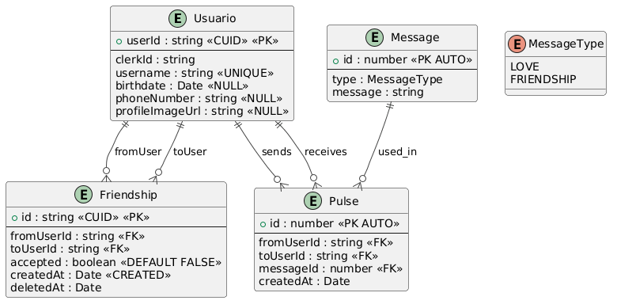

<h1> 
  Feelink
</h1>
App de conexión entre amigos y parejas sin necesidad de enviarse mensajes, solo pulsar y transmitir un sentimiento, una expresion, todo instantáneo sin necesidad, solo conexión.

<h3>Tecnologías</h3>

<h3>Requisitos del sistema</h3>
Los usuarios deben poder iniciar sesión e introducir sus datos personales, como nombre, fecha de nacimiento (opcional), número de teléfono (opcional), imagen de perfil y un username único, que servirá como identificador para que otros usuarios puedan buscarlos.

Además, los usuarios podrán agregar amistades buscando a otros mediante su username. Cuando se envíe una solicitud de amistad, el usuario receptor podrá visualizarla, ver la información de quien la envía y decidir si la acepta o la rechaza. Una vez aceptada la solicitud, ambos usuarios podrán eliminar la amistad en cualquier momento desde el apartado de amistades.

La aplicación utilizará las notificaciones del dispositivo para informar cuando un usuario reciba una solicitud de amistad y cuando se le envíe una señal.

Entre usuarios que sean amigos, se podrán enviar señales acompañadas de mensajes (como “Te quiero”, entre otros). Estas acciones tendrán limitaciones; por ejemplo, inicialmente se permitirá enviar una señal cada 4 horas.

Los mensajes estarán predefinidos y almacenados en la base de datos, organizados por tipos. Según el tipo seleccionado, se mostrarán los mensajes disponibles que se pueden enviar.

La aplicación deberá permitir cambiar el idioma entre español, inglés y portugués.

Finalmente, la app contará con un enlace a Ko-fi para que los usuarios puedan realizar donaciones y apoyar su desarrollo.

<h3>Modelo de negocio</h3>

